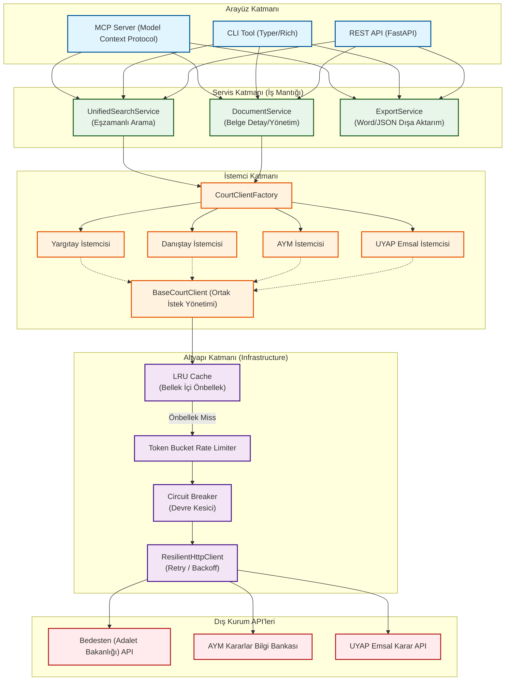

# Mimari ve Tasarım Desenleri

Divan projesi, modüler, test edilebilir ve sürdürülebilir bir yapıda kalmasını sağlamak amacıyla **SOLID prensipleri** çerçevesinde katmanlı bir mimariyle tasarlanmıştır. Bu dokümanda projenin katmanlı yapısı ve kullanılan tasarım desenleri açıklanmaktadır.

## Sistem Mimarisi Şeması

Aşağıdaki şema, kullanıcı arayüzlerinden dış kurum API'lerine kadar olan istek akışını ve katmanlar arasındaki ilişkileri göstermektedir:

## Katmanlı Mimari

Sistem, sorumlulukların ayrılması prensibine uygun olarak katmanlı bir yapıda geliştirilmiştir. Bağımlılıkların asgari düzeyde tutulması hedeflenmiştir.

### 1. Çekirdek (Core/Domain) Katmanı
Sistemin temel iş modellerini ve arayüz tanımlarını barındıran katmandır. Dış kütüphanelere (FastAPI, httpx vb.) bağımlılığı yoktur, temel olarak standart Python tiplerini ve veri doğrulama için Pydantic kütüphanesini kullanır.
*   **Modeller:** `Decision`, `SearchQuery`, `SearchResult` vb. veri sınıfları buradadır. Farklı kaynaklardan gelen tüm kararlar ortak `Decision` modeline dönüştürülerek işlenir.
*   **Arayüzler (Interfaces):** `ICourtClient`, `ISearchService` gibi soyut taban sınıfları (Abstract Base Class - ABC) bu katmanda yer alarak diğer katmanlar arasındaki iletişimi tanımlar.
*   **Hatalar:** `DivanError` hiyerarşisindeki tüm özel istisna (exception) sınıflarını barındırır.

### 2. Altyapı (Infrastructure) Katmanı
Sistemin çalışması için gerekli olan yardımcı araçları ve altyapı bileşenlerini içerir.
*   **ResilientHttpClient:** Yeniden deneme (retry), üstel geri çekilme (exponential backoff) ve devre kesici (circuit breaker) mekanizmalarını barındıran asenkron bir HTTP istemci arayüzüdür.
*   **Rate Limiter:** Token Bucket algoritması kullanarak harici servislerin limitlerini aşmamak amacıyla aşırı istek atılmasını sınırlar.
*   **Circuit Breaker:** Bir API'nin ardışık başarısız istekler vermesi durumunda geçici olarak istek göndermeyi durdurarak uygulamanın gereksiz beklemeler yapmasını önler.
*   **Cache:** TTL (Time-To-Live) destekli bellek içi (in-memory) önbellekleme işlevini sağlar.

### 3. İstemci (Clients) Katmanı
İlgili kurum veya mahkemelerin veri kaynaklarına (web servisleri, API'ler) erişen ve verileri çeken bileşenlerin yer aldığı katmandır. Tüm istemciler `BaseCourtClient` sınıfından türetilir.
*   **BaseCourtClient:** HTTP isteklerinin yapılması, önbellek kontrolü, hata yönetimi ve çekilen belgelerin (HTML/PDF) Markdown formatına dönüştürülmesi gibi ortak süreçleri üstlenir.
*   **CourtClientFactory:** İstemcilerin konfigürasyon ve diğer bağımlılıklarla (RateLimiter, CircuitBreaker) doğru şekilde örneklenmesini yönetir.

### 4. Servis (Services) Katmanı
İş mantığının (business logic) yürütüldüğü katmandır. Dış arayüzlerin (CLI, API) doğrudan istemcilere bağımlı olmasını önler.
*   **UnifiedSearchService:** Birden fazla veri kaynağını (örneğin Bedesten ve Emsal) eşzamanlı sorgulamak amacıyla asenkron çağrılar yapar ve dönen sonuçları tekilleştirerek birleştirir.
*   **DocumentService:** Kararların tam metinlerinin indirilmesi ve önbellekten okunması süreçlerini yönetir.
*   **ExportService:** Kararların JSON veya Markdown gibi formatlara dönüştürülmesi işlemlerini üstlenir.

### 5. Arayüz (Interfaces) Katmanı
Kullanıcıların veya harici sistemlerin uygulamayla etkileşime girdiği en dış katmandır.
*   **MCP Sunucusu (`mcp/`):** Uyumlu yapay zeka istemcileriyle (örn. Claude Desktop vb.) stdio üzerinden haberleşen Model Context Protocol (MCP) arayüzüdür.
*   **REST API (`api/`):** Harici sistemlerin web istekleriyle uygulamaya erişmesini sağlayan FastAPI tabanlı web arayüzüdür.
*   **CLI (`cli/`):** Komut satırı (terminal) üzerinden sorgulama ve yönetim işlemlerinin yapılabilmesini sağlayan Typer/Rich tabanlı komut arayüzüdür.

---

## Tasarım Desenleri

1.  **Fabrika Deseni (Factory Pattern - `CourtClientFactory`)**: Çalışma zamanında (runtime) ilgili mahkeme veya kurum istemcisinin doğru konfigürasyon ve bağımlılıklarla oluşturulmasını sağlar.
2.  **Strateji Deseni (Strategy Pattern)**: Ortak `ICourtClient` arayüzü sayesinde, servislerin hangi veri kaynağıyla çalıştığından bağımsız olarak aynı arayüz üzerinden işlem yapabilmesini sağlar.
3.  **Circuit Breaker Deseni**: Dış servislerde yaşanabilecek kesintilere karşı sistemin dayanıklılığını artırmak amacıyla `CLOSED` -> `OPEN` -> `HALF_OPEN` durum makinesini kullanır.
4.  **Bağımlılık Enjeksiyonu (Dependency Injection)**: Konfigürasyon, RateLimiter ve CircuitBreaker gibi bileşenlerin sınıflara dışarıdan geçirilmesini sağlayarak test edilebilirliği (mock kullanımını) kolaylaştırır.
